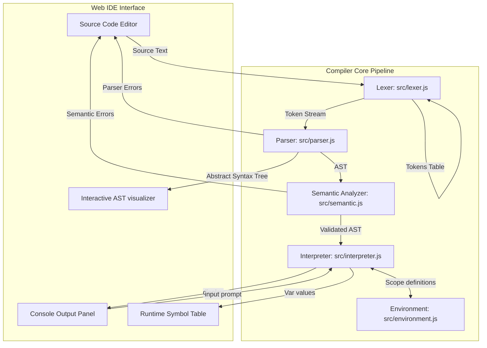

# ⚡ ZenLang Compiler & Interactive IDE

**Compiler Design Course Project - Complete Interpreted Mini Programming Language (Phases 1 to 6)**  
A modular, browser-based compiler pipeline and interactive IDE for **ZenLang**, written in Vanilla HTML, CSS, and JavaScript.

---

## 📋 Table of Contents

1. [Overview](#-overview)
2. [Compiler Architecture Flow](#-compiler-architecture-flow)
3. [Grammar Specifications (EBNF)](#-grammar-specifications-ebnf)
4. [Language Specifications & Keywords](#-language-specifications--keywords)
5. [Compiler Phases & Implementation](#-compiler-phases--implementation)
6. [Interactive Web IDE Features](#-interactive-web-ide-features)
7. [Project Structure](#-project-structure)
8. [Installation & Verification](#-installation--verification)
9. [Viva Questions & Answers (Phases 1-6)](#-viva-questions--answers-phases-1-6)
10. [Future Scope](#-future-scope)

---

## 🎯 Overview

This project implements a complete, hand-written interpreter for **ZenLang**, a custom-designed mini programming language. It takes raw text source code, tokenizes it (Lexical Analysis), parses it into an Abstract Syntax Tree (Syntax Analysis), validates identifier scopes and static types (Semantic Analysis), and executes the code on a virtual terminal console (Interpretation).

**Key Objectives Accomplished:**
*   **Lexer (Phase 1):** Breaks source code into a detailed stream of classified tokens.
*   **Parser (Phase 2):** Hand-written **Recursive Descent Parser** that maps tokens to a nested Abstract Syntax Tree (AST).
*   **Semantic Analyzer (Phase 3):** Performs identifier lookup tracking, scope boundary validations, duplicate declaration checking, and type conformity checks.
*   **Runtime Environment & Interpreter (Phase 4):** Evaluates AST nodes recursively (tree-walk interpreter) with dynamic environment chaining to handle lexical scoping.
*   **Web IDE & AST Visualizer (Phase 5):** Interactive environment featuring a collapsible graphical AST node explorer, dynamic token/symbol scopes, and a simulated output terminal.

---

## 📐 Compiler Architecture Flow

The ZenLang compiler runs entirely client-side. The pipeline is designed as follows:



---

## 📜 Grammar Specifications (EBNF)

To resolve expressions and statements unambiguously, ZenLang is defined using a non-left-recursive Context-Free Grammar. Operator precedence is handled structurally.

```ebnf
Program             ::= StatementList
StatementList       ::= Statement*
Statement           ::= VarDecl
                      | Assignment
                      | WhenStatement
                      | WhileStatement
                      | ForStatement
                      | DisplayStatement
                      | InputStatement
                      | BlockStatement

VarDecl             ::= Type Identifier ("=" Expression)? ";"
Type                ::= "num" | "deci" | "string" | "bool" | "char"
Assignment          ::= Identifier "=" Expression ";"
AssignmentNoSemi    ::= Identifier "=" Expression
BlockStatement      ::= "{" StatementList "}"

WhenStatement       ::= "when" "(" Expression ")" BlockStatement ("else" BlockStatement)?
WhileStatement      ::= "while" "(" Expression ")" BlockStatement
ForStatement        ::= "for" "(" (VarDecl | Assignment | ";") Expression ";" AssignmentNoSemi ")" BlockStatement

DisplayStatement    ::= "display" "(" Expression ")" ";"
InputStatement      ::= "input" "(" Expression ")" ";"

/* Expression Hierarchy for Operator Precedence */
Expression          ::= LogicalOrExpr

LogicalOrExpr       ::= LogicalAndExpr ( "||" LogicalAndExpr )*
LogicalAndExpr      ::= EqualityExpr ( "&&" EqualityExpr )*
EqualityExpr        ::= RelationalExpr ( ( "==" | "!=" ) RelationalExpr )*
RelationalExpr      ::= AdditiveExpr ( ( "<" | ">" | "<=" | ">=" ) AdditiveExpr )*
AdditiveExpr        ::= MultiplicativeExpr ( ( "+" | "-" ) MultiplicativeExpr )*
MultiplicativeExpr  ::= UnaryExpr ( ( "*" | "/" | "%" ) UnaryExpr )*
UnaryExpr           ::= ( "!" | "-" ) UnaryExpr 
                      | PrimaryExpr

PrimaryExpr         ::= Identifier
                      | Literal
                      | "(" Expression ")"
                      | CallExpression

CallExpression      ::= "input" "(" Expression ")"
                      | "display" "(" Expression ")"

Literal             ::= NumberLiteral
                      | StringLiteral
                      | BooleanLiteral
                      | CharLiteral
```

---

## 🌟 Language Specifications & Keywords

### Type System & Coercions
ZenLang supports static declarations with runtime verification:
1.  `num` - Stored as JavaScript integers (coerced using `Math.trunc` on assignment).
2.  `deci` - Floating point values.
3.  `string` - Double quoted (`"..."`) or single quoted (`'...'`) character strings.
4.  `bool` - Logical state (`true` or `false`).
5.  `char` - Single characters (string of length 1, single quotes).

*   **Type Promotion:** Operations between `num` and `deci` automatically promote results to `deci`.
*   **Concatenation Coercion:** Adding a `string` to any other type automatically converts the non-string operand to text and performs string concatenation.

### Keyword Reference

| Keyword | Purpose | Sample Syntax |
|---|---|---|
| `num` | 32-bit Integer declaration | `num count = 0;` |
| `deci` | Float declaration | `deci fraction = 0.75;` |
| `string` | Text string declaration | `string greet = "hello";` |
| `bool` | Boolean declaration | `bool flag = true;` |
| `char` | Character declaration | `char letter = 'A';` |
| `when` | Conditional branch (if) | `when (x > 5) { ... }` |
| `else` | Alternative branch (else) | `else { ... }` |
| `while` | Loop statement | `while (count < 10) { ... }` |
| `for` | Loop statement | `for (num i = 0; i < 5; i = i + 1) { ... }` |
| `display` | Prints output to terminal | `display("Value is: " + x);` |
| `input` | Dialog prompt returning string | `string text = input("Enter name: ");` |

---

## 🛠️ Compiler Phases & Implementation

### 1. Lexical Analysis (`src/lexer.js`)
Performs a character scanning pass on lines. Matches patterns using JavaScript regular expressions and outputs token objects:
*   Includes `bool`, `true`, and `false` support.
*   Maps line numbers for diagnostic reports.

### 2. Recursive Descent Parser (`src/parser.js`)
Consumes the token stream sequentially. If an error is hit, it appends details to an error log and enters `synchronize()` mode:
*   Discards tokens until a statement boundary (like `;` or keywords like `when`, `while`) is reached to resume compiling downstream code. This prevents one syntax mistake from breaking compile diagnostic reporting for the whole file.
*   Converts grammar rules into AST nodes.

### 3. Semantic Analysis (`src/semantic.js`)
Constructs an internal stack of symbol maps representing active scopes (lexical scope nesting):
*   **Undeclared Variables:** Triggers error if an identifier is assigned to or read before it is defined.
*   **Duplicate Declarations:** Triggers error if a variable name is declared multiple times in the same scope level.
*   **Static Type Checking:** Enforces strict assignments, ensuring types evaluated in expressions match the target variable.

### 4. Interpretation Engine & Environment (`src/environment.js`, `src/interpreter.js`)
Executes the validated AST directly using a recursive tree-walk:
*   **Runtime Types:** Stored values are represented as objects `{ type, value }` to maintain boundaries between data types (like integer division vs decimal division).
*   **Lexical Scoping:** Variables are stored in nested `Environment` scopes containing parent links, allowing inner scopes to resolve outer values.
*   **Infinite Loop Protection:** Enforces a loop budget of 5000 iterations to prevent browsers from freezing on infinite loop code.

---

## 💻 Interactive Web IDE Features

The user interface has been completely revamped into a professional compiler workbench:
1.  **Code Editor:** Responsive panel supporting live line counts.
2.  **Output Console:** Simulated terminal showing execution progress, display logs, and echoes input prompt inputs.
3.  **AST Tree Visualizer:** Interactive graphical representation of the parsed AST with collapsible nodes.
4.  **Token Table:** Displays the full matched lexeme stream with categorized badges.
5.  **Symbol Table:** Lists declared variables, their static types, active scope labels, and **live runtime values** post-execution.
6.  **Diagnostic Logs:** Captures syntax, semantic, and runtime errors in bright red alerts with line pointers.

---

## 📁 Project Structure

```
compilerr/
├── index.html                   # HTML Entry point (three-panel layout)
├── styles.css                   # Premium CSS styles & animations
├── app.js                       # IDE Coordinator (coordinates compilation stages)
├── test_compiler.js             # [NEW] CommonJS Node compiler test suite
├── README.md                    # Project documentation
└── src/
    ├── lexer.js                 # Lexer (Phase 1, extended with boolean types)
    ├── parser.js                # Recursive Descent Parser
    ├── semantic.js              # Scope & Type Semantic Checker
    ├── environment.js           # Lexical Environment scope states
    ├── interpreter.js           # AST Tree-walk interpreter
    └── visualizer.js            # DOM-based interactive AST drawing tree
```

---

## 🚀 Installation & Verification

### Running the IDE in Browser
1.  Clone/download this directory.
2.  Double-click `index.html` (or serve it locally) to run the compiler IDE in any modern browser.
3.  Click **Load Demo** to populate sample loops, conditions, and prompts, then click **Run Code**.

### Verification Suite
You can verify the compiler components via terminal tests if Node.js is installed:
```bash
node test_compiler.js
```
This runs assertions against five test programs (checking basic math, type mismatches, undeclared variables, duplicate variables, and loop iteration counts).

---

## 🎓 Viva Questions & Answers (Phases 1-6)

### Phase 1: Lexical Analysis
**Q1: How does the lexer distinguish keywords from identifiers?**  
*   **A:** The lexer matches identifiers using the regex `/^[a-zA-Z_][a-zA-Z0-9_]*/`. Once an identifier lexeme is matched, it checks if it exists in the reserved `keywords` Set. If yes, it is classified as a `KEYWORD` token; otherwise, it is classified as an `IDENTIFIER` token.

**Q2: What is the purpose of returning line numbers with tokens?**  
*   **A:** Line numbers are tracked by the lexer and carried by tokens into AST nodes. This allows downstream compiler phases (parser, semantic checker, and interpreter) to point to the exact line of code when reporting errors.

### Phase 2: Syntax Analysis (Parser)
**Q3: What is a Recursive Descent Parser?**  
*   **A:** It is a top-down parser that parses input tokens by defining a set of recursive functions, where each function corresponds to a non-terminal rule in the Context-Free Grammar.

**Q4: How does your parser resolve operator precedence?**  
*   **A:** Precedence is resolved by structuring parsing methods hierarchically. Lower precedence operators (like assignment `=` or logical `||`) are parsed first, calling higher precedence methods (like arithmetic multiplication `*` or unary `-`) as sub-components. This pushes higher precedence operations deeper into the tree, ensuring they evaluate first.

**Q5: What is parser synchronization?**  
*   **A:** Synchronization is an error recovery technique. When a syntax error is thrown (like a missing semicolon), the parser logs it, discards tokens until it finds a statement delimiter (like `;` or a statement keyword), and resumes parsing the next line. This allows the compiler to detect multiple syntax errors in a single compilation run instead of crashing on the first issue.

### Phase 3: Semantic Analysis
**Q6: What checks does the Semantic Analyzer perform that the Parser cannot?**  
*   **A:** The Parser only checks if the code is grammatically correct (e.g. `num x = "string";` is grammatically correct). The Semantic Analyzer validates meaning: it checks if variables were declared before use, detects if a variable is declared twice in the same scope, and checks if data types match during assignment.

**Q7: How is scope checked in your compiler?**  
*   **A:** We use a stack of scopes (implemented as an array of JavaScript Map objects). When entering a block statement `{`, we push a new Map onto the stack. When declaring variables, we insert them into the top map. When resolving identifiers, we search from the top map down to the bottom (global) map. When leaving the block `}`, we pop the top map.

### Phase 4 & 5: Interpreter & Web IDE
**Q8: What is a tree-walk interpreter?**  
*   **A:** It is an execution engine that directly traverses the Abstract Syntax Tree. It visits each statement node recursively, evaluating child expression nodes to calculate program results at runtime without generating intermediate assembly code.

**Q9: Why does the interpreter store variables as `{ type, value }` objects rather than raw JavaScript values?**  
*   **A:** Storing type metadata alongside values allows the interpreter to emulate ZenLang-specific type rules accurately, such as integer division (truncation) for `num` types, preventing float promotion unless a `deci` operand is explicitly involved.

---

## 🎯 Future Scope

*   **Syntax Highlighting Editor:** Integrate the code editor panel with CodeMirror or Monaco to support full syntax coloring.
*   **Code Optimization Phase:** Implement a folding optimizer that pre-calculates static arithmetic constants at the AST level before execution (e.g. optimizing `x = 2 + 3;` to `x = 5;`).
*   **Compiled Target (Assembly/Bytecode):** Add a code generation button to compile ZenLang AST nodes into WebAssembly (Wasm) or JVM Bytecode for native hardware execution.
